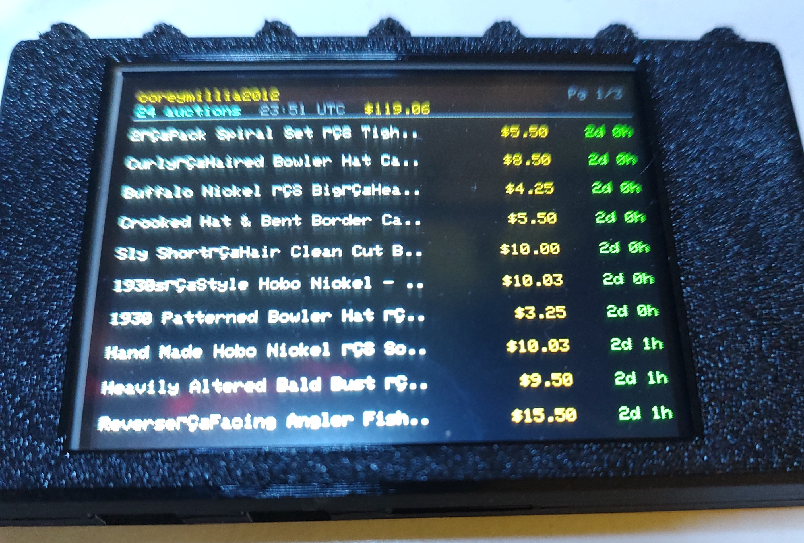
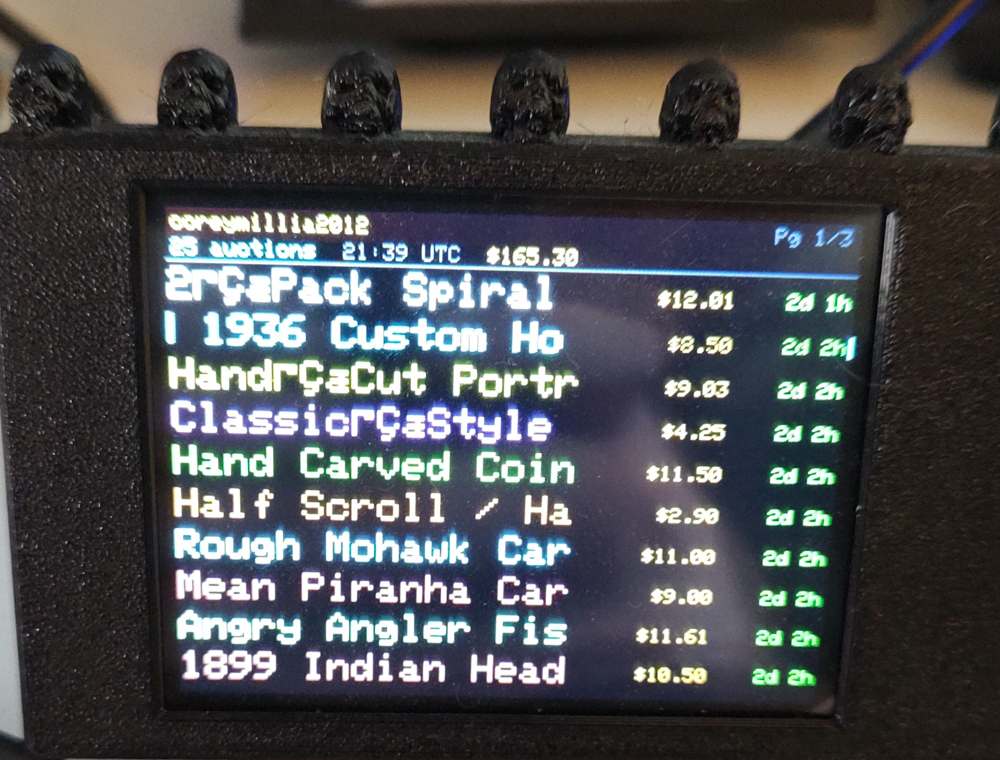

# CYDEbayTicker

A live **eBay auction monitor** for the **CYD (Cheap Yellow Display)** ESP32 board — built for any eBay seller or buyer who wants to follow their auctions in real time without staring at a browser.

Originally built for personal use to keep an eye on active coin and hobo nickel auctions, it was designed to be as easy as possible for anyone to set up and use. Just flash it, connect to the setup portal from your phone, enter your credentials, and you're live.

**Displays** your active auctions sorted by ending soonest, with live countdowns, current bids, a running bid total, and automatic fast-refresh when any auction enters its final hour.





---

## What It Shows

Up to **60 auctions** across up to 3 sellers, sorted by ending soonest and paginated 10 per screen.

```
coreymillia2012                          Pg 1/3
24 auctions  23:51 UTC  $119.06
────────────────────────────────────────────────
Hand Carved Hobo Nickel 1930 Bu..  $10.03  45m 0s
Buffalo Nickel Hand Engraved...     $8.50   2d 0h
Heavily Altered Bald Bust рG...     $9.50   2d 1h
...
```

| Column | Description |
|--------|-------------|
| **Title** | Scrolling auction title — each row a different color, long titles scroll one at a time in order |
| **Price** | Current bid amount |
| **Time left** | 🟢 Green — more than 1 hour · 🟠 Orange — under 1 hour · 🔴 Red — ENDED |

**Header line 1:** Your seller name(s) + page indicator  
**Header line 2:** Auction count (cyan) · last updated time (grey) · total confirmed bids (gold)

**Tap left half of screen** — previous page  
**Tap right half of screen** — next page  
**Hold BOOT 3 seconds** — re-enter setup

### Automatic Snipe Mode

When any auction enters its final **1 hour**, the device automatically switches to:
- **60-second** full refresh (vs. 5 minutes normally)
- **10-second** countdown tick (vs. 30 seconds normally)

It switches back to normal pace once all auctions are back above 1 hour or ended.

If eBay temporarily returns a gateway timeout or other transient API error, the device now keeps showing the **last successful auction set** and marks the header timestamp as **stale** instead of blanking the screen with a fetch failure.

---

## Hardware

- **Board:** ESP32 CYD (ESP32-2432S028R or compatible — the "Cheap Yellow Display")
- **Display:** ILI9341 TFT 320×240 landscape
  - DC = GPIO 2, CS = GPIO 15, SCK = GPIO 14, MOSI = GPIO 13, MISO = GPIO 12
- **Touch:** XPT2046 resistive touchscreen controller (VSPI — CLK = GPIO 25, MISO = GPIO 39, MOSI = GPIO 32, CS = GPIO 33, IRQ = GPIO 36)
- **Backlight:** GPIO 21 (active HIGH)
- **BOOT button:** GPIO 0 (active LOW, INPUT_PULLUP)

> ⚠️ The ESP32 only supports **2.4 GHz** WiFi networks.

---

## Getting an eBay Developer Account

> ⚠️ **The eBay Developer Program is a completely separate website and account from eBay.com.** You cannot use your regular eBay login credentials here. You must create a new, independent account at `developer.ebay.com`. Think of it as a different company — same brand, entirely separate system.

### Step 1 — Create a Developer Account (allow up to 24 hours for approval)

1. Go to **[developer.ebay.com](https://developer.ebay.com)** — this is **not** ebay.com
2. Click **Register** and create a **new account** with your email address
   - Do **not** try to use your eBay.com username or password here
3. Accept the **eBay Developer Program License Agreement**
4. Submit your registration — **approval can take up to 24 hours**
5. You'll receive a confirmation email when your developer account is approved

### Step 2 — Generate a Production Keyset

Once approved:

1. Log in at [developer.ebay.com](https://developer.ebay.com) with your **developer account** credentials
2. Go to **My Account → Application Keysets**
3. Under the **Production** section, click **Create Application Keyset**
4. Give it any name (e.g. `CYDEbayTicker`)
5. You will be shown a **Data Access Agreement** — check the box confirming that your application **does not store or persist eBay data**. This firmware qualifies — it only holds data in RAM while running and never writes auction data to storage.
6. After agreeing, your keyset is generated

### Step 3 — Copy Your Keys

From your Production keyset page you'll see three keys:

| Key | Used for |
|-----|---------|
| **App ID (Client ID)** | ✅ Enter this in the setup portal |
| **Cert ID (Client Secret)** | ✅ Enter this in the setup portal |
| Dev ID | ❌ Not needed — ignore this one |

Your **App ID** looks like: `YourName-YourApp-PRD-xxxxxxxx-xxxxxxxx`  
Your **Cert ID** looks like: `PRD-xxxxxxxxxxxxxxxx-xxxxxxxxxxxxxxxx`

> ✅ The free tier provides **5,000 API calls/day** — well above what this device uses.

---

## First-Time Setup

1. Flash the firmware (see [Building](#building-with-platformio) below)
2. On first boot the display shows setup instructions and the ESP32 broadcasts a WiFi AP:
   ```
   SSID:     CYDEbay_Setup
   Password: (none — open network)
   ```
3. Connect your phone or PC to `CYDEbay_Setup`
4. Open a browser to **`192.168.4.1`**
5. Fill in the form:

| Field | What to enter |
|-------|--------------|
| **Network Name (SSID)** | Your home 2.4 GHz WiFi name |
| **WiFi Password** | Your WiFi password (blank if open) |
| **Production App ID** | From developer.ebay.com — the Client ID |
| **Production Cert ID** | From developer.ebay.com — the Client Secret |
| **Seller ID #1 / #2 / #3** | eBay seller usernames to track (e.g. `coreymillia2012`) |
| **Seller Search Keyword(s)** | Comma-separated words from your listing titles (e.g. `coin,silver,hobo,nickel`). Required if using seller IDs. |
| **Category ID** | Optional — eBay category number as an alternative to keywords (e.g. `13473` for Exonumia). Overrides keywords if set. |
| **Item Keyword** | Only used if no seller IDs are set — searches all of eBay by keyword |

6. Tap **Save & Connect**

Settings are stored in the ESP32's non-volatile flash (NVS) and survive reboots and power cycles.

### Finding Your eBay Seller Username

Your seller ID is your **eBay username** — not your store display name and not your store URL. It appears under "Seller information" on any of your listings. Example: if your store URL is `ebay.com/str/coreymillia2012`, your seller ID is just `coreymillia2012`.

### About Seller Search Keywords

eBay's Browse API requires at least one search term when filtering by seller. Enter words that appear in your listing titles, comma-separated:

```
coin,silver,hobo,nickel,carved
```

Each keyword makes one API call and results are **deduplicated by item ID**, so the same listing won't appear twice even if it matches multiple keywords. More keywords = broader coverage of your inventory. No spaces needed around commas.

### Re-entering Setup

Hold the **BOOT button for 3 seconds** at any time while the device is running. The screen shows "Restarting setup..." and the device reboots into setup mode.

---

## Display Layout

```
┌─────────────────────────────────────────────────┐
│ coreymillia2012                        Pg 1/3   │  ← gold / grey
│ 24 auctions  23:51 UTC  $119.06                 │  ← cyan / grey / gold
│─────────────────────────────────────────────────│
│ Hand Carved Hobo Nickel 1930..  $10.03   45m 0s │  ← orange (< 1hr)
│ Buffalo Nickel Hand Engraved..   $8.50    2d 0h │  ← green
│ Heavily Altered Bald Bust рG..   $9.50    2d 1h │  ← green
│ ...                                             │
└─────────────────────────────────────────────────┘
```

- **Bid total** — only counts auctions with confirmed bids (starting prices not included)
- **Snipe mode** — triggers automatically when any auction enters last hour (see above)
- **Title colors** — each of the 10 rows uses a distinct color (white, cyan, yellow, magenta, green, orange, sky blue, peach, light cyan, amber) making rows easy to track at a glance
- **Scrolling titles** — long titles that don't fit the column scroll one row at a time in order; when a row finishes scrolling it pauses, resets, and the next long title takes its turn

---

## Building with PlatformIO

### Dependencies (auto-installed by PlatformIO)

```
moononournation/GFX Library for Arduino @ 1.4.7
bblanchon/ArduinoJson @ ^7
https://github.com/PaulStoffregen/XPT2046_Touchscreen.git
```

Built-in to ESP32 Arduino core: `WiFiClientSecure`, `HTTPClient`, `WebServer`, `DNSServer`, `Preferences`

### Build & Upload

```bash
cd CYDEbayTicker
pio run --target upload
```

### Serial Monitor (useful for debugging API errors)

```bash
pio device monitor --baud 115200
```

Serial output shows OAuth token status, per-keyword fetch results, and full error bodies on API failures.

---

## Project Structure

```
CYDEbayTicker/
├── platformio.ini       # Board: esp32dev, framework: arduino, libs
├── include/
│   ├── Portal.h         # Captive portal web UI, NVS load/save, all credential globals
│   ├── eBay.h           # OAuth token fetch, Browse API calls, item parse/dedup/sort
│   └── CYDIdentity.h    # ESP32 self-identification HTTP server (GET /identify)
└── src/
    └── main.cpp         # Display init, NTP sync, header/listing draw, touch, scrolling, refresh loop
```

---

## CYDIdentity Patch

This firmware includes the **CYDIdentity patch** — a lightweight HTTP server running on port 80 that responds to `GET /identify` with a JSON description of the device:

```json
{
  "name":       "CYDEbayTicker",
  "mac":        "AA:BB:CC:DD:EE:FF",
  "version":    "1.0.0",
  "uptime_s":   3742,
  "rssi":       -58,
  "last_fetch": 1709584800,
  "errors":     0
}
```

This is designed to work with **CYDPiAlert** — a companion firmware for a second CYD board connected to a [Pi.Alert](https://github.com/pucherot/Pi.Alert) Raspberry Pi network scanner. CYDPiAlert's "ESP Devices" mode scans your local network, probes each device's `/identify` endpoint, and displays the name, IP, uptime, and signal strength of every patched ESP32 on your network — and can automatically rename unknown devices in Pi.Alert by their firmware name.

`errors` is a bitmask:

- `0` = no current fetch errors
- `1` = OAuth/token fetch failure
- `2` = Browse API fetch failure

### What the patch adds

- Serves `GET /identify` on port 80 (shares the port with the setup portal; portal closes before identity server starts)
- Requires `CYDIdentity.h` in the `include/` folder
- Calls `identityBegin()` in `setup()` after WiFi connects and portal closes
- Calls `identityHandle()` at the top of `loop()` to service incoming requests
- Adds no noticeable overhead — the identity server only wakes when a request arrives

### Using without CYDPiAlert

The identity endpoint is harmless if you don't have CYDPiAlert — it just sits there silently and answers if anything asks. You can query it manually:

```bash
curl http://<device-ip>/identify
```

---

## How It Works

1. **Captive portal setup** — on first boot the ESP32 runs a WiFi access point with a web server. You configure everything through a browser. Settings are written to NVS flash.
2. **WiFi + NTP** — connects to your network, then syncs UTC time from `pool.ntp.org`. UTC time is required to calculate accurate countdowns from eBay's ISO 8601 end timestamps.
3. **OAuth token** — fetches a 2-hour Bearer token from `api.ebay.com/identity/v1/oauth2/token` using your App ID + Cert ID (Client Credentials grant). Token is cached in RAM and auto-refreshed. If `api.ebay.com` DNS resolution fails on the ESP32, the firmware can bootstrap the official host by known public IPs while still using `api.ebay.com` as the TLS/HTTP host.
4. **Browse API fetch** — for each seller + keyword combination, calls `api.ebay.com/buy/browse/v1/item_summary/search` with `filter=sellers:{id},buyingOptions:{AUCTION}`. Results are deduplicated by eBay item ID across calls. Browse requests use the same official-host bootstrap path as OAuth.
5. **Merge & sort** — all items combined and sorted by `endEpoch` ascending (soonest ending = row 1).
6. **Live countdown** — time-left column redraws on a tick interval (10s in snipe mode, 30s normal) without re-fetching.
7. **Full refresh** — re-fetches all data every 60s (snipe mode) or 5 minutes (normal).

### Data Persistence Policy

This firmware **does not persist any eBay data**. Auction titles, prices, and end times are held only in RAM and are cleared on every fetch and on every reboot. The only data written to flash (NVS) is user-entered configuration: WiFi credentials, App ID, Cert ID, seller IDs, and search keywords. This satisfies the eBay Developer Program's data storage requirements.

---

## Troubleshooting

| Error on screen | Cause | Fix |
|----------------|-------|-----|
| `Fetch failed: OAuth connection refused (-1)` | Token refresh could not open HTTPS connection | Check WiFi/router connectivity and DNS; transient network/TLS issues retry automatically |
| `Fetch failed: OAuth DNS failed` | DNS could not resolve the official eBay API host | Firmware retries with fallback DNS servers, then bootstraps `api.ebay.com` by known public IPs while keeping the official TLS/HTTP host name |
| `Fetch failed: HTTP 401` | OAuth token invalid or truncated | Re-enter Cert ID in setup; check for copy/paste errors |
| `Fetch failed: HTTP 400` | Keyword or category issue | Check your keyword field — try simpler single words |
| `Fetch failed: HTTP 403` | Wrong keys or Sandbox keys used | Use **Production** keys, not Sandbox |
| `Fetch failed: No auctions found` | No matching auction listings | Seller may have no active auctions, or keywords don't match any titles |
| `Fetch failed: No sellers/keyword` | Setup incomplete | Hold BOOT 3s to re-enter setup |
| `WiFi failed: "YourSSID"` | Wrong SSID/password or 5 GHz network | Hold BOOT 3s; ESP32 requires 2.4 GHz |
| Times wrong / `ENDED` for active items | NTP failed | Check router DNS; will retry on next boot |
| Only partial auctions found | Keyword doesn't match all listing titles | Add more comma-separated keywords covering all your listing title words |

### April 2026 connectivity fix

Some ESP32 networks started failing to resolve `api.ebay.com` even though the rest of the device was online. That looked like `OAuth -1` at first, but the real break was:

1. DNS resolution for the official eBay API host became unreliable on the ESP32.
2. After bypassing DNS, the firmware still had to handle real HTTP response bodies correctly (`Content-Length` and `Transfer-Encoding: chunked`) or valid JSON would be misread as a parse error.

The current firmware now:

- keeps using the **official** eBay OAuth and Browse host: `api.ebay.com`
- retries transient HTTPS failures once
- retries DNS using fallback resolvers
- bootstraps the official host by known public IPs when hostname lookup still fails
- parses both fixed-length and chunked JSON responses correctly
- exposes better live failure state through `/identify`

---

## Notes

- Only **auction-format listings** are shown. Buy It Now / fixed price listings are filtered out.
- The bid total in the header counts only listings where someone has **actually placed a bid** — starting price listings with zero bids are not included.
- Up to **60 total listings** stored. With multiple keywords per seller each fetching up to 50 items, coverage is broad but there is a cap.
- Seller IDs are case-insensitive on eBay's end.
- eBay developer account approval can take up to 24 hours — plan ahead before your next auction batch.
